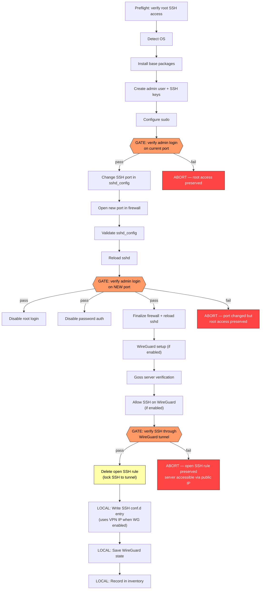

# loft-cli

> **A self-hosted infrastructure compiler — turns a typed YAML spec into a reviewable plan, deterministic execution, and human-readable ops docs for fresh Linux servers.**

loft-cli is **Layer 1**. It makes VMs ready and usable: bootstrap, harden, install services, deploy containers, manage configuration, detect drift, and verify state — all from a single typed YAML spec.

---

## Installation

### Option 1 — pip (recommended for Python users)

```bash
pip install loft-cli
```

### Option 2 — Standalone binary

Download the pre-built binary for your platform from the [Releases](../../releases) page:

**Client binary** (runs on your machine):

| Platform | File |
|---|---|
| Linux (x86-64) | `loft-cli-linux-amd64` |
| Linux (ARM64) | `loft-cli-linux-arm64` |
| macOS (Intel) | `loft-cli-macos-amd64` |
| macOS (Apple Silicon) | `loft-cli-macos-arm64` |

```bash
chmod +x loft-cli-linux-amd64
sudo mv loft-cli-linux-amd64 /usr/local/bin/loft-cli

# Verify
loft-cli --help
```

**Agent binary** (installed on managed servers — Linux only):

| Platform | File |
|---|---|
| Linux (x86-64) | `loft-cli-agent-linux-amd64` |
| Linux (ARM64) | `loft-cli-agent-linux-arm64` |

The agent binary is automatically installed on servers during bootstrap. You generally don't need to download it manually — use `loft-cli agent-update <host>` to update an existing agent.

### Option 3 — Docker

```bash
docker run --rm ghcr.io/1ops-eu/loft-cli:latest --help
```

With a spec file and SSH key:

```bash
docker run --rm \
  -v ~/.ssh:/root/.ssh:ro \
  -v $(pwd)/my-server.yaml:/spec.yaml:ro \
  ghcr.io/1ops-eu/loft-cli:latest apply /spec.yaml
```

---

## What loft-cli does

1. **Validate** — checks a YAML spec for correctness and safety
2. **Plan** — generates a deterministic, reviewable execution plan
3. **Docs** — renders a human-readable Markdown ops guide from the plan
4. **Apply** — executes the plan safely, enforcing SSH lockout prevention
5. **Doctor** — detects drift between desired and actual server state
6. **Reconcile** — re-applies only the drifted resources

From a single YAML spec, you get:
- A secure, hardened Linux server (SSH key-only, custom port, ufw, WireGuard)
- A Markdown runbook you can put in your wiki
- A local `~/.ssh/conf.d/` entry for easy SSH access
- A local inventory with full historization

---

## Quick Start

### 1. Bootstrap a fresh server

```bash
# Create your spec
cp examples/bootstrap.yaml my-server.yaml
# Edit: set host.address, login.private_key, admin_user.pubkeys

# Validate
loft-cli validate my-server.yaml

# Preview the plan
loft-cli plan my-server.yaml

# Generate ops docs
loft-cli docs my-server.yaml -o MY_SERVER_BOOTSTRAP.md

# Apply (bootstraps the server)
loft-cli apply my-server.yaml
```

After apply, you can SSH directly:
```bash
ssh my-server-name  # via the ~/.ssh/conf.d/ entry loft-cli created
```

### 2. Install PostgreSQL

```bash
loft-cli apply examples/postgres.yaml
```

### 3. Deploy a Docker container

```bash
loft-cli apply examples/app-container.yaml
```

### 4. Detect and fix drift

```bash
# Check whether the server matches the spec
loft-cli doctor my-server.yaml

# Re-apply only the resources that have drifted
loft-cli reconcile my-server.yaml
```

### 5. WireGuard tunnel workflow

```bash
# After bootstrap with wireguard.enabled: true:
loft-cli tunnel up my-server      # bring up the tunnel
ssh my-server                      # SSH routes through the VPN IP automatically
loft-cli tunnel status             # view all hosts + active/inactive state
loft-cli tunnel down my-server     # tear down the tunnel
```

---

## Commands

```
loft-cli validate  <spec.yaml>          Validate a spec file
loft-cli plan      <spec.yaml>          Show the execution plan
loft-cli docs      <spec.yaml> [-o FILE] [--mode guide|commands]
                                         Generate Markdown ops docs
loft-cli diff      <spec.yaml>          Show what would change on the server
loft-cli apply     <spec.yaml> [--dry-run] [--mode auto|agent|client]
                                         Execute the plan
loft-cli doctor    <spec.yaml>          Detect drift between desired and actual state
loft-cli reconcile <spec.yaml>          Re-apply only drifted resources
loft-cli version   [--host HOST]        Print client (+ agent) version
loft-cli update                         Self-update client from GitHub Releases
loft-cli agent-update <host>            Update agent on remote host
loft-cli inspect   run <run-id>         Inspect a past run
loft-cli inventory list                 List all servers
loft-cli inventory show <server-id>     Show server details
loft-cli rotate-secret <spec> --secret NAME
                                         Rotate a secret and re-apply
loft-cli tunnel  up <host>              Bring up WireGuard tunnel for a host
loft-cli tunnel  down <host>            Tear down WireGuard tunnel for a host
loft-cli tunnel  status                 List all hosts with WireGuard state
loft-cli remove  <host> [--force]       Remove all local state for a host
```

### WireGuard Client Prerequisites

The `tunnel` commands and the WireGuard safety gate during `apply` run
`wg-quick` and `ip` via `sudo` on your **local** machine. This requires:

1. **`wireguard-tools`** installed locally (provides `wg` and `wg-quick`)
2. **Passwordless `sudo`** for `wg`, `wg-quick`, and `ip` — without it, the
   subprocess hangs waiting for a password prompt and times out after 30s

To grant passwordless sudo for WireGuard commands only:

```bash
# Create /etc/sudoers.d/wireguard-loft-cli with:
%sudo ALL=(ALL) NOPASSWD: /usr/bin/wg, /usr/bin/wg-quick, /usr/sbin/ip

# Use visudo to validate syntax:
sudo visudo -f /etc/sudoers.d/wireguard-loft-cli
```

If WireGuard is not enabled in your spec, these prerequisites do not apply.

### Global CLI Options

All commands that load specs support these options:

| Option | Description |
|---|---|
| `--env-file PATH` | Load environment variables from a `.env` file. Repeatable — later files override earlier ones. Environment variables already set take precedence over all `.env` files. |
| `--passthrough` | Leave unresolved `${VAR}` references unchanged instead of erroring. Useful for generating docs or plans from specs with variables you don't want to resolve yet. |

---

## Project Structure

loft-cli imposes no directory layout, but this pattern works well for teams managing one or more servers:

```
my-project/
  servers/
    prod-1/
      bootstrap.yaml      ← kind: bootstrap
      services.yaml       ← kind: service, stack, etc.
      .env                ← per-server variables (SERVER_IP, SSH_PORT, ...)
    staging-1/
      bootstrap.yaml
      services.yaml
      .env
  shared/
    .env                  ← shared variables (ORG_NAME, SSH_KEY_PATH, ...)
  templates/
    nginx-site.conf.j2    ← Jinja2 templates for kind: file_template
```

**Applying a spec with env files:**

```bash
# Layer shared variables first, then server-specific overrides on top
loft-cli apply servers/prod-1/bootstrap.yaml \
  --env-file shared/.env \
  --env-file servers/prod-1/.env
```

`--env-file` is repeatable. Resolution order (highest priority first):

1. Shell environment variables (`export KEY=value`)
2. Last `--env-file` on the command line
3. Earlier `--env-file` files
4. Spec defaults (`${VAR:-default}`)

Each server has its own `.env` for values that differ per host (IP address, SSH port, WireGuard addresses). Shared credentials and org-wide defaults go in a common `.env`.

> **Auto-discovery of `.env` files** (loading the sibling `.env` automatically without spelling out `--env-file`) is planned — see ROADMAP v1.1.

---

## Architecture

```
YAML Spec (supports multi-document ---)
  └─ Parse (loader.py)            ← registry lookup: kind -> model class
       └─ Validate (validators.py) ← registry lookup: kind -> validator fn
            └─ Normalize (normalizer.py) ← registry lookup: kind -> normalizer fn
                 └─ Plan (planner.py) ← registry lookup: kind -> planner fn
                      ├─ Docs  (render_markdown.py)
                      ├─ Diff  (render_diff.py)     ← compare plan against runtime state
                      └─ Apply
                           ├─ Agent mode (AgentTransport)
                           │    └─ Upload plan → loft-cli-agent apply → retrieve result
                           ├─ Client mode (FabricTransport)
                           │    └─ Step dispatch via SSH (legacy, deprecated)
                           └─ Local steps:
                                ├─ SSH conf.d entry
                                ├─ WireGuard state
                                └─ Local inventory
```

**Plan is the single source of truth.** Both docs and apply are generated from the same Plan object — what you review is exactly what executes. The `Transport` protocol decouples execution from Fabric SSH.

### Agent-First Execution

Since v0.3, loft-cli uses an **agent-first architecture**. The `loft-cli-agent` binary is installed on the target server as the first step of every bootstrap. The client becomes a thin transporter:

1. Client connects via SSH, uploads the agent binary + plan
2. Client invokes `loft-cli-agent apply` on the server
3. Agent executes all steps locally (no SSH round-trips for each command)
4. Client retrieves the result

This means SSH restarts during bootstrap are a non-event — the agent continues operating locally.

### Three-Package Monorepo

The codebase is split into three installable packages under `packages/`:

```
packages/
  core/     loft-cli-core    Shared models, specs, registry infrastructure
  client/   loft-cli         CLI tool, compiler, runtime, transports
  agent/    loft-cli-agent   Server-side executor, state management
```

See each package's README for detailed architecture:
- [`packages/core/README.md`](packages/core/README.md) — spec schemas, plan models, registry system, policy engine
- [`packages/client/README.md`](packages/client/README.md) — compiler pipeline, transports, local state, updater
- [`packages/agent/README.md`](packages/agent/README.md) — executor, state tracking, mutation locking

### How Spec Dispatch Works

loft-cli is **not** a keyword scanner. It uses a registry-based dispatch system:

1. Every YAML spec has a `kind` field (e.g., `kind: bootstrap` or `kind: service`).
2. The `kind` value is looked up in an open registry to find the matching Pydantic model, normalizer, validator, and planner.
3. The **planner** inspects which blocks in the spec are populated and generates a deterministic list of `Step` objects. Empty blocks are skipped.
4. The **executor** dispatches each step by its `step.kind` (e.g., `ssh_command`, `gate`, `local_file_write`) via a step handler registry.

This means new spec kinds and step types can be added by external addons without modifying any core source files.

### Registry System

Seven open registries power the pipeline — each maps a string key to a callable:

| Registry | Maps | Signature |
|---|---|---|
| `SPEC_REGISTRY` | `kind` -> Pydantic model class | `kind: str -> type` |
| `PLANNER_REGISTRY` | `kind` -> plan-builder | `(spec, ctx) -> list[Step]` |
| `NORMALIZER_REGISTRY` | `kind` -> normalizer | `(spec, ctx) -> None` |
| `VALIDATOR_REGISTRY` | `kind` -> validator | `(spec) -> list[ValidationIssue]` |
| `STEP_HANDLER_REGISTRY` | `step.kind` -> executor handler | `(executor, step) -> StepResult` |
| `HOOKS_REGISTRY` | `kind` -> `KindHooks` lifecycle | dataclass with callbacks |
| `RESOLVER_REGISTRY` | `prefix` -> value resolver | `(key: str) -> str \| None` |

Built-in kinds (`bootstrap`, `service`) are registered at startup. External addons register via Python `entry_points`:

```toml
# addon's pyproject.toml
[project.entry-points."loft_cli.addons"]
my_addon = "my_addon:register"
```

### KindHooks Lifecycle

Each spec kind can declare lifecycle hooks via `KindHooks`:

- `needs_key_generation` — auto-generate SSH key pairs before normalization
- `ssh_port_fallback` — on re-runs, try `ssh.port` if `login.port` is unreachable; also probes admin user with key auth on the fallback port to handle fully-hardened servers
- `on_inventory_record` — post-apply callback to record results in inventory

### SSH Lockout Prevention

The critical bootstrap invariant enforced by the planner:

```
Step 10: [GATE] verify_admin_login_on_new_port
Step 11: disable_root_login         (depends_on: [10])
Step 12: disable_password_auth      (depends_on: [10])
```

Steps 11 and 12 **never execute** unless the gate (SSH login verification) passes. If the gate fails, the plan aborts and you keep root access.

When WireGuard is enabled, an additional **tunnel safety gate** is inserted between the `allow_ssh_on_wireguard` and `delete_open_ssh_rule` steps. This gate brings up the WireGuard tunnel locally, verifies SSH connectivity through the VPN IP, and only then allows the open SSH rule to be deleted. If the gate fails, the tunnel is torn down and the server remains accessible via public IP.

### Server Verification (Goss)

`loft-cli apply` automatically verifies the server after every successful bootstrap using [Goss](https://github.com/goss-org/goss):

1. Generates a goss spec from the live spec values (ports, users, WireGuard interface, etc.)
2. Installs goss on the remote server if absent
3. Uploads the spec to `~/.goss/<spec-name>.yaml`
4. Accumulates it into a master gossfile `~/.goss/goss.yaml` (so re-running adds to, not replaces, prior specs)
5. Runs `goss -g ~/.goss/goss.yaml validate` and displays a Rich results table

If goss cannot run for any reason, apply prints a **bold yellow warning** and continues — the server is still configured.

Each example in `examples/ubuntu/` ships as a pair — a loft-cli YAML and a matching `.goss.yaml` reference spec side-by-side in the same folder.

---

## How It Works Under the Hood

This section traces what happens when you run `loft-cli apply spec.yaml` — from YAML file to configured server.

### Pipeline Overview


The pipeline has six phases. Each phase uses the [registry system](#registry-system) to dispatch by `kind`, so the same pipeline handles `bootstrap`, `service`, and any addon-defined kinds.

### Phase 1: Parse

**Entry:** `loft-cli/specs/loader.py` → `load_spec()`

1. If `--env-file` was provided, loads `KEY=VALUE` pairs into the environment (existing env vars take precedence; multiple files are merged in order).
2. Reads the YAML file with `yaml.safe_load()` into a raw Python dict.
3. Reads the `kind` field (e.g. `"bootstrap"`) and looks up the matching Pydantic model class from `SPEC_REGISTRY`.
4. Recursively walks the dict and resolves all `${[prefix:]key[:-default]}` tokens via the resolver registry. In strict mode, an unresolved token is a fatal error with the exact field path. In passthrough mode, it is left as-is.
5. Hydrates the resolved dict into a typed Pydantic v2 model (e.g. `BootstrapSpec`).

**Output:** A fully typed spec object.

### Phase 2: Validate

**Entry:** `loft-cli/specs/validators.py` → `validate_spec()`

Dispatches to the kind-specific validator via `VALIDATOR_REGISTRY`. Validators check for structural and semantic errors — for example:

- SSH port in valid range
- WireGuard config completeness (all required fields when enabled)
- Containers require Docker to be enabled
- Password auth disable requires at least one pubkey

Returns a list of issues, each tagged as `error` (fatal) or `warning` (informational).

### Phase 3: Normalize

**Entry:** `loft-cli/compiler/normalizer.py` → `normalize()`

Resolves everything the planner will need so that plan generation is purely deterministic:

- Applies `LOFT_CLI_STATE_DIR` / `local.state_dir` overrides
- Resolves relative paths against the spec file's directory
- Reads SSH public key file contents
- Reads WireGuard server private key, derives public key via PyNaCl
- Generates or reuses the WireGuard client key pair
- Resolves database secrets from environment variables
- Computes local filesystem paths (SSH conf.d, inventory DB)

**Output:** A `NormalizedContext` dataclass with all resolved values — no further I/O is needed.

### Phase 4: Plan

**Entry:** `loft-cli/compiler/planner.py` → `plan()`

Dispatches to the kind-specific planner via `PLANNER_REGISTRY`. The planner inspects which blocks in the spec are populated and generates an ordered list of `Step` objects. Empty or absent blocks produce no steps.

Each `Step` carries:

| Field | Purpose |
|---|---|
| `scope` | `REMOTE` (SSH), `LOCAL` (this machine), or `VERIFY` (verification) |
| `kind` | Dispatch key for the executor — `ssh_command`, `gate`, `local_file_write`, etc. |
| `command` | Shell command string (built by pure functions in `runtime/steps/`) |
| `depends_on` | List of step indices that must succeed before this step runs |
| `gate` | If `true`, failure aborts the entire plan |

The planner also embeds file contents directly into steps (e.g. the Goss verification spec, SSH config fragments) so that the Plan is fully self-contained.

Finally, the Plan is stamped with a `spec_hash` and `plan_hash` for traceability.

**Output:** A `Plan` object — the single source of truth for docs, apply, and inspection.

### Phase 5: Execute

**Entry:** `loft-cli/runtime/executor.py` → `Executor.apply()`

The executor iterates over the Plan's steps in order. For each step:

1. **Check dependencies** — if any step in `depends_on` has failed, this step is skipped.
2. **Check abort** — if a gate has failed, all remaining steps are skipped.
3. **Check policy** — if a `policy.yaml` is present on the server, the policy engine evaluates the step before it runs (see [Policy Engine](#policy-engine)).
4. **Dispatch** — looks up `STEP_HANDLER_REGISTRY[step.kind]` and calls the handler.

Step handlers:

| Step Kind | What happens |
|---|---|
| `ssh_command` | Runs the command on the remote server via Fabric (Paramiko SSH) |
| `ssh_upload` | Uploads embedded file content to a remote path |
| `gate` | Attempts an SSH login to verify connectivity — failure aborts the plan |
| `verify` | Runs Goss validation or other verification checks |
| `local_file_write` | Writes a file on the local machine (e.g. SSH config) |
| `local_command` | Runs a local operation (backup SSH config, save WireGuard state) |
| `local_db_write` | Initializes or updates the local SQLite inventory |

### Phase 6: Record

After execution completes, three things happen:

1. **Inventory** — the `KindHooks.on_inventory_record` callback writes server metadata and run results to the SQLite inventory (with full historization via versionize triggers).
2. **Run log** — a JSON file is written to `~/.loft-cli/runs/` with per-step timing, status, and output.
3. **Cleanup** — the SSH session is closed.

### Bootstrap Execution Flow

The bootstrap plan is the most complex, with ~25 steps including three safety gates:



**Key safety properties:**

- **Gate 1** (pre-port-change): Verifies that the admin user can log in with key auth before the SSH port is changed.
- **Gate 2** (post-port-change): Verifies admin login on the new port. `disable_root_login`, `disable_password_auth`, and `finalize_firewall` all carry `depends_on` pointing to this gate — they **never execute** unless the gate passes.
- **Gate 3** (WireGuard tunnel, if enabled): After `allow_ssh_on_wireguard`, the client brings up the WireGuard tunnel and verifies SSH through the VPN IP. Only if this succeeds is the open SSH rule deleted.
- **Goss verification** is non-fatal — a failure is reported but does not abort the plan.

---

## Spec Types

### `kind: bootstrap`

Hardens a fresh Debian/Ubuntu server:
- Creates admin user with SSH key auth
- Configures custom SSH port
- Disables root login and password auth
- Enables UFW firewall
- Configures WireGuard VPN (with auto-generated client key pair)
- Updates local SSH config + inventory

See [examples/bootstrap.yaml](examples/bootstrap.yaml)

### `kind: service`

Installs services on an already-bootstrapped server:
- PostgreSQL (with optional role/database creation)
- Nginx (with site configuration and reverse proxy support)
- Docker
- Docker containers (with health checks)

See [examples/postgres.yaml](examples/postgres.yaml), [examples/nginx-reverse-proxy/](examples/nginx-reverse-proxy/), and [examples/app-container.yaml](examples/app-container.yaml)

### `kind: file_template`

Renders managed configuration files on the server from Jinja2 templates and variables. Change detection is hash-based — unchanged files are not re-written on re-apply.

See [examples/file-template/](examples/file-template/)

### `kind: compose_project`

Manages Docker Compose projects on the server:
- Uploads compose file and configuration
- Validates with `docker compose config`
- Pulls images, brings services up
- Health-check aware startup with configurable timeout

See [examples/compose-project/](examples/compose-project/)

### `kind: stack`

Groups related resources (`file_template`, `compose_project`, etc.) into a single deployable application boundary. Resources are declared inline with explicit dependency ordering. Execution follows topological sort — circular dependencies are rejected at validation time.

See [examples/stack/](examples/stack/)

### `kind: http_check`

GET-only HTTP readiness probe with retry/backoff. Usable as a standalone check or as a dependency gate inside a `kind: stack`. Returns success only when the endpoint responds with the expected status code.

```yaml
kind: http_check
meta:
  name: app-ready
host:
  name: prod-1
check:
  url: http://localhost:3000/health
  expected_status: 200
  retries: 10
  retry_delay_seconds: 5
```

### `kind: systemd_unit`

Deploys and manages host-native systemd services. Supports optional logrotate configuration for service log files.

```yaml
kind: systemd_unit
meta:
  name: my-worker
host:
  name: prod-1
unit:
  name: my-worker
  exec_start: /usr/local/bin/my-worker
  user: deploy
  restart: always
```

### `kind: systemd_timer`

Deploys scheduled execution via systemd timers (oneshot service + `.timer` unit pair).

```yaml
kind: systemd_timer
meta:
  name: nightly-cleanup
host:
  name: prod-1
timer:
  name: nightly-cleanup
  on_calendar: "02:00"
  exec_start: /usr/local/bin/cleanup.sh
```

### `kind: backup_job`

Defines backup operations with retention and scheduling via a systemd timer. Supports `postgres_dump` and `directory` backup types.

```yaml
kind: backup_job
meta:
  name: db-backup
host:
  name: prod-1
backup:
  type: postgres_dump
  database: myapp
  destination: /var/backups/myapp
  retention_days: 30
  schedule: "03:00"
```

### `kind: postgres_ensure`

Ensures PostgreSQL resources exist on a running instance: users, databases, extensions, and grants. Structured declarations only — no arbitrary SQL.

```yaml
kind: postgres_ensure
meta:
  name: app-db
host:
  name: prod-1
ensure:
  users:
    - name: app
      password_env: APP_DB_PASSWORD
  databases:
    - name: myapp
      owner: app
  extensions:
    - database: myapp
      name: pgcrypto
```

### Multi-document specs

A single YAML file can contain multiple specs separated by `---`. All documents in the file are processed in order using the same env files:

```yaml
kind: postgres_ensure
# ...
---
kind: compose_project
# ...
```

---

## Drift Detection and Reconciliation

After initial apply, servers can drift from their declared spec — packages updated manually, config files changed, services stopped. `loft-cli doctor` detects this drift and `loft-cli reconcile` corrects it.

```bash
# Compare the server's current state against the spec
loft-cli doctor servers/prod-1/services.yaml --env-file servers/prod-1/.env

# Re-apply only the resources that have drifted
loft-cli reconcile servers/prod-1/services.yaml --env-file servers/prod-1/.env
```

`doctor` reports per-resource drift status without making any changes. `reconcile` runs the planner over only the drifted resources and applies the delta — resources that match their desired state are skipped.

Use `loft-cli diff` to see what *would* change on the server before committing to a reconcile:

```bash
loft-cli diff servers/prod-1/services.yaml --env-file servers/prod-1/.env
```

---

## Policy Engine

The policy engine lets you control which plan steps execute automatically versus which require explicit approval or are denied outright. Policy is **inert by default** — if no `policy.yaml` is present on the server, all steps execute without restriction.

### policy.yaml format

```yaml
version: "1"
default_action: auto_apply   # auto_apply | require_approval | deny

rules:
  - name: deny-root-commands
    match_id: "run_as_root_*"
    action: deny

  - name: approve-schema-migrations
    match_tags: [schema_migration]
    action: require_approval

  - name: auto-apply-health-checks
    match_kind: http_check
    action: auto_apply
```

Rules are evaluated in order. The first matching rule wins. If no rule matches, `default_action` applies.

### Rule matching

Each rule can match on any combination of (all specified conditions must hold):

| Field | Matches | Example |
|---|---|---|
| `match_kind` | Step kind (exact) | `"ssh_command"`, `"http_check"` |
| `match_id` | Step ID (glob pattern) | `"install_*"`, `"*_migration"` |
| `match_tags` | Any of the listed tags | `[destructive, schema_migration]` |

### Approval tokens

For `require_approval` steps, generate a time-limited HMAC token:

```bash
# Generates a token valid for 1 hour (default)
loft-cli rotate-secret --generate-approval-token --step-id install_schema_v2
```

Pass the token during apply:

```bash
loft-cli apply spec.yaml --approval-token <TOKEN>
```

Tokens are validated locally on the agent — no network round-trip required. They are scoped to a specific server (keyed by server identity) and expire automatically.

---

## WireGuard Tunnel Workflow

When `wireguard.enabled: true` in a bootstrap spec, loft-cli:

1. Generates a server+client WireGuard key pair and stores it locally under `~/.wg/loft-cli/`
2. Configures the WireGuard interface on the server (`wg0`)
3. Adds a UFW rule allowing SSH only from the WireGuard peer address
4. Verifies the tunnel is reachable from your machine (safety gate) before deleting the open SSH rule
5. Writes your SSH conf.d entry using the **VPN IP** as `HostName` (not the public IP)

After bootstrap, `ssh prod-1` only works through the tunnel:

```bash
loft-cli tunnel up prod-1       # creates wg-prod-1 interface locally
ssh prod-1                       # connects via VPN IP — works
loft-cli tunnel down prod-1     # removes wg-prod-1 interface
```

### Per-host interface naming

Client-side interfaces use `wg-{hostname}` (e.g. `wg-prod-1`, `wg-staging-1`). Multiple tunnels can be active simultaneously without collision.

### tunnel status

```bash
loft-cli tunnel status
```

Lists all known hosts with WireGuard state — shows VPN IPs, endpoints, deployment timestamps, and whether the tunnel is currently active.

---

## Environment Variable Resolution

Spec files support `${VAR}` references (and a richer prefix syntax) that are resolved at load time:

```yaml
kind: service
meta:
  name: my-app
login:
  private_key: ${SSH_KEY_PATH}
postgres:
  create_role:
    name: app
    password_env: ${DB_PASSWORD}
```

### Token syntax

| Token | Meaning |
|---|---|
| `${VAR}` | Bare reference — shorthand for `${env:VAR}`. |
| `${env:VAR}` | Explicit environment variable lookup. |
| `${file:/path/to/file}` | Read file contents (trailing newline stripped). `~` is expanded. Returns `None` if the file does not exist. |
| `${prefix:key}` | Dispatch to any addon-registered resolver (e.g. `sops`, `vault`). |
| `${VAR:-default}` | Use *default* if the resolved value is `None`. Works with any prefix: `${env:HOST:-localhost}`, `${file:/run/secrets/key:-}`, etc. |

### Resolution behaviour

- **Strict mode** (default): unresolved tokens raise an error with the exact field path (e.g., `Unresolved variable '${DB_PASSWORD}' in field 'postgres.create_role.password_env'`).
- **Passthrough mode** (`--passthrough`): unresolved references are left as-is.
- **`.env` file support** (`--env-file .env`): loads variables from a file before resolving. Repeatable — pass multiple `--env-file` flags to layer files.

### Addon resolvers

External addons can register custom resolver backends (e.g. SOPS, HashiCorp Vault, AWS SSM) by calling `register_resolver(prefix, fn)` in their `register()` function:

```python
from loft_cli.registry import register_resolver

def register():
    register_resolver("sops", _resolve_sops)

def _resolve_sops(key: str) -> str | None:
    # key format: "path/to/secrets.yaml#json.dot.path"
    ...
```

Once registered, specs can use `${sops:secrets.yaml#db.password}` — no changes to core loft-cli required.

### `.env` file format

```env
# Comments are supported
KEY=value
KEY="quoted value"
KEY='single quoted'
export KEY=value    # export prefix is stripped
```

---

## Local State Layout

loft-cli stores all local state in three directories on your machine. None of these directories are on the server — they live on the operator's machine.

```
~/.loft-cli/
  ├── inventory.db                    ← SQLite inventory database (see below)
  ├── keys/
  │   └── {provider}/
  │       └── {host}/
  │           ├── id_ed25519          ← SSH private key (0600, write-once)
  │           └── id_ed25519.pub      ← SSH public key (0644)
  └── runs/
      └── {timestamp}_{spec-name}.json  ← structured JSON run log per apply

~/.ssh/
  ├── config                          ← one Include line added by loft-cli (never removed)
  └── conf.d/loft-cli/
      └── {provider}--{host}.conf     ← SSH alias fragment per server

~/.wg/loft-cli/
  └── {provider}/
      └── {host}/
          ├── private.key             ← server WireGuard private key (0600, write-once)
          ├── public.key              ← server WireGuard public key (0644)
          ├── wg0.conf                ← server wg-quick config as deployed to the server
          ├── client.key              ← client WireGuard private key (0600, write-once)
          ├── client.conf             ← client wg-quick config (used by tunnel up/down)
          └── metadata.json           ← interface name, VPN IPs, endpoint, timestamps
```

**Provider scoping:** All paths use `{provider}/{host}` nesting when `host.provider` is set in the spec (e.g. `hetzner`, `ionos`). This prevents collisions when the same hostname exists on multiple cloud providers. Without a provider, a flat layout is used.

**SSH config fragment example:**

```
# loft-cli managed: hetzner--prod-1
# Requires: loft-cli tunnel up prod-1
Host hetzner--prod-1
  HostName 10.10.0.1
  User deploy
  Port 2222
  IdentityFile ~/.loft-cli/keys/hetzner/prod-1/id_ed25519
  IdentitiesOnly yes
```

When WireGuard is active, `HostName` is the VPN IP, not the public IP. The comment reminds you the tunnel must be up.

**Write-once semantics:** `private.key` and `client.key` are never overwritten. WireGuard peer identity must be stable — regenerating keys would break the tunnel on the server side.

### Goss specs (server-side)

Goss specs are stored on the **server** (not on your machine) at `~/.goss/`. The master gossfile accumulates specs from all bootstrap runs:

```
~/.goss/goss.yaml              ← master gossfile (accumulates all specs)
~/.goss/{spec-name}.yaml       ← individual spec per bootstrap run
```

### inventory.db

`~/.loft-cli/inventory.db` is a SQLite database that records every server loft-cli has managed. It uses the **versionize historization** pattern — records are never deleted; each change appends a new version row with timestamps. The current state is available via `vv_*` views.

**Three tables:**

| Table | What it stores |
|---|---|
| `tv_server` | Per-server metadata: name, address, provider, OS family, SSH config (alias, user, port, identity file), WireGuard settings |
| `tv_server_service` | Deployed services per server: service type, name, status, and a `metadata_json` blob with kind-specific detail (postgres version, nginx sites, compose project names, systemd unit names, backup schedules, etc.) |
| `tv_run` | Execution history: spec hash, plan hash, kind, status, started/finished timestamps, per-resource metadata |

**Historization:** Every row has `version_valid_from`, `version_valid_to`, `version_changed_by`, and `version_changed_at` columns. A record with `version_valid_to = '9999-12-31'` is current. When a server is decommissioned via `loft-cli remove`, its status is updated to `decommissioned` — it is never deleted from the database.

**CLI access:**

```bash
loft-cli inventory list                  # list all servers (current state)
loft-cli inventory show prod-1           # full detail for one server
```

**Direct SQLite access** (for ad-hoc queries):

```bash
sqlite3 ~/.loft-cli/inventory.db \
  "SELECT name, address, bootstrap_status FROM vv_server"
```

**Encryption:** The database uses Python's built-in `sqlite3`. The agent binary also supports SQLCipher (drop-in replacement) for encrypted at-rest storage — available in commercial variants.

> **Planned:** `loft-cli inventory export --format json` and a global `~/.loft-cli/.env` fallback are on the ROADMAP for v1.1.

---

## Configurable State Directory

You can consolidate all state under a single directory for isolation (e.g., testing, CI, multi-environment setups):

### Option 1: Environment variable

```bash
export LOFT_CLI_STATE_DIR=/tmp/loft-cli-test
loft-cli apply my-spec.yaml
# All state goes to /tmp/loft-cli-test/{keys/, ssh/conf.d/, wg/, inventory.db, runs/}
```

### Option 2: Spec field

```yaml
local:
  state_dir: /opt/loft-cli/staging
```

**Priority order:** `LOFT_CLI_STATE_DIR` env var > `local.state_dir` spec field > built-in defaults.

---

## Spec-Relative Path Resolution

Relative paths in specs (e.g., `pubkeys: [.secrets/key.pub]`) are resolved against the **spec file's directory**, not the current working directory. This ensures specs work correctly regardless of where loft-cli is invoked from.

Absolute paths and `~`-prefixed paths are resolved normally.

---

## SSH Key Generation

When applying a bootstrap spec, loft-cli automatically generates missing SSH key pairs. If `admin_user.pubkeys` references a `.pub` file whose corresponding private key doesn't exist, loft-cli generates an ed25519 key pair before proceeding. Generated keys are stored at `~/.loft-cli/keys/{provider}/{host}/id_ed25519`. This is controlled per-kind via the `KindHooks.needs_key_generation` flag.

---

## SSH Port Fallback

On re-runs after a partial bootstrap that already moved SSH to the new port, loft-cli detects that `login.port` (typically 22) is unreachable and automatically falls back to `ssh.port` (the configured post-bootstrap port). This prevents the need to manually edit specs between re-runs.

---

## Addon / Extension Architecture

loft-cli is designed for extensibility. Every dispatch point in the pipeline uses an open registry, so new spec kinds and step execution types can be added by external Python packages without touching core source files.

### Writing an addon

1. Create a Python package with a `register()` function
2. Register it as a `loft_cli.addons` entry point

```toml
# pyproject.toml
[project.entry-points."loft_cli.addons"]
my_addon = "my_addon:register"
```

```python
# my_addon/__init__.py
def register():
    from loft_cli.registry import (
        register_spec_kind, register_planner, register_normalizer,
        register_validator, register_step_handler, register_kind_hooks, KindHooks,
    )
    register_spec_kind("my_kind", MySpec)
    register_normalizer("my_kind", _normalize_my_kind)
    register_planner("my_kind", _plan_my_kind)
    register_validator("my_kind", _validate_my_kind)
    register_step_handler("my_step", _handle_my_step)
    register_kind_hooks("my_kind", KindHooks(on_inventory_record=_record_my_kind))
```

### Built-in addon: Goss

The `goss/` addon is a reference implementation that demonstrates the addon pattern. It generates server-state verification specs from live bootstrap values and runs them post-apply.

---

## Tested Platforms

loft-cli targets **Debian and Ubuntu** on any Linux server (bare metal or cloud VM). The agent binary supports Linux amd64 and arm64. The client binary runs on Linux, macOS (Intel + Apple Silicon).

| Target OS | Architecture | Notes |
|---|---|---|
| Ubuntu 22.04 LTS | amd64, arm64 | Fully supported |
| Ubuntu 24.04 LTS | amd64, arm64 | Fully supported; uses socket-activated sshd |
| Debian 12 | amd64, arm64 | Fully supported |
| Debian 13 | amd64 | Tested |

Cloud providers: Hetzner Cloud, IONOS, OVH, generic VPS (any provider that gives root SSH access).

---

## Development

```bash
# Install with dev dependencies (creates .venv automatically)
make dev

# Run tests
make test            # unit + integration (no live host needed)
make smoke           # smoke tests against all example specs
make test-local      # local integration tests

# Lint and format
make lint            # ruff check + black --check
make fmt             # ruff fix + black format

# Smoke tests against example specs (one at a time)
make validate-example
make plan-example
make docs-example
```

### Building standalone binaries locally

```bash
make build-binary         # Client binary (no system deps needed)
make build-agent-binary   # Agent binary (no system deps needed)
```

### Building the Docker image locally

```bash
make build-docker
```

---

## Release flow

Releases are triggered by Git tags:

```bash
# Bump version in all three packages' pyproject.toml files, then:
git add packages/core/pyproject.toml packages/client/pyproject.toml packages/agent/pyproject.toml
git commit -m "chore(release): bump version to 0.11.0"
git push origin main

git tag v0.11.0
git push origin v0.11.0
```

GitHub Actions will automatically:
1. Build client binaries for Linux (amd64, arm64) and macOS (Apple Silicon)
2. Build agent binaries for Linux (amd64, arm64) — agent is Linux-only
3. Generate `checksums.txt` covering all binaries
4. Create a GitHub Release with all assets
5. Build and push the Docker image to `ghcr.io/1ops-eu/loft-cli`
6. Publish all three packages (loft-cli-core, loft-cli, loft-cli-agent) to PyPI

---

## What loft-cli is not

- Not a general-purpose config management system (not Ansible)
- Not a Kubernetes orchestrator
- Not an application-level orchestrator — it does not configure SaaS applications, import workflows, or seed business data (that's Layer 2, handled by the orchestration layer or commercial addons)

**V1 scope:** Single host, Debian/Ubuntu only, PostgreSQL + Nginx + Docker as the built-in service kinds.

---

## Roadmap

See [ROADMAP.md](ROADMAP.md) for the full milestone plan from v0.1 through v1.0 and beyond, including planned work on Compose hardening, feature catalog, reusable blueprints, multi-host operations, and v1.1 service additions (Langfuse, Temporal) and developer ergonomics (.env auto-discovery, inventory export).

---

## License

Apache 2.0 — see [LICENSE](LICENSE)
